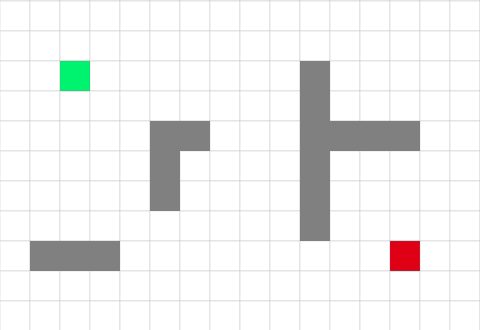
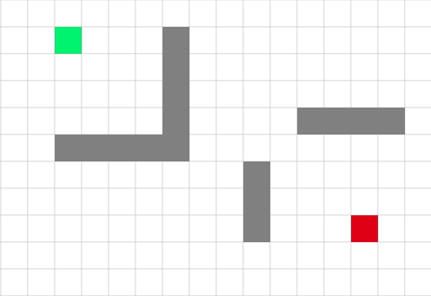
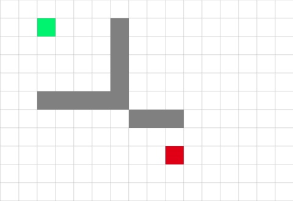
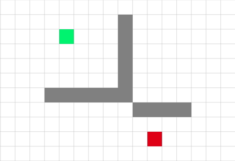

Path Finder
===========
#### Path finding visualisation using javascrip. ####

Introduction
------------

The aim of this project is to visualisate basic path-finder algorithms.

Currently available:
* [BFS](https://en.wikipedia.org/wiki/Breadth-first_search)
* [Greedy BFS (manhattan and euclidean heuristics)](http://theory.stanford.edu/~amitp/GameProgramming/AStarComparison.html#algorithms)
* [A* (manhattan and euclidean heuristics)](http://theory.stanford.edu/~amitp/GameProgramming/AStarComparison.html#algorithms)

Examples
--------

BFS:

Greedy BFS, manhattan heuristic:

Greedy BFS, euclidean heuristic:

A*, manhattan heuristic:

A*, euclidean heuristic:

